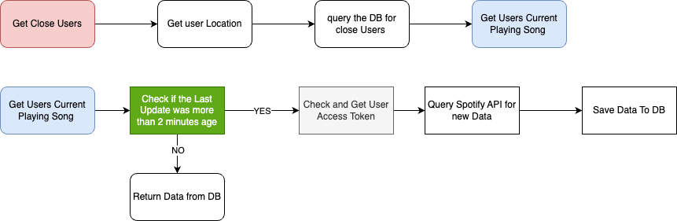

# LSTN Server

an App build with React Native and Nodejs to find what the people around you are listening to and help u to connect with them

this is the NodeJs server repo for the App Repo [HERE](https://github.com/technoo0/LSTN)

## The Stack

- Nodejs
- Express
- Prisma
- TypeScript
- Postgresql
- JWT

## The System Design

1. **Authentication:-**

for the authentication, I went with a simple approach the user just needs to authenticate them self and the server gonna find if the user is a New user or an existing user and will guide them through the steps instead of the user choosing login or signup  

also, I implemented Oauth from multiple providers (Gmail, Apple, Facebook, and Using Email) 

when the user uses their Email to Authenticate there is no password the server will send a code that will expire in 5 minutes and the user need to enter the code to verify that they own the email

.png)

1. **Music App**

the app currently only supports Spotify as a music app to get data from 

the user is required to Authenticate with their Spotify account upon signing in to the app 

after that the Spotify Auth sends a code to the server then the server uses this code to fetch the access token (which expires in an hour) and Refresh token 

when the server needs to use the access token first it needs to check it has been more than an hour from the last update to the token if it expires the server gets a new token and saved it to the database 

.png)

1. **Searching For Users**

upon opening the app the app sends the user location to be saved in the Database

when a user requests a search the server queries the database for users in a 10 miles radius 

then the list of the users gets checked for the users who already are listening to songs 

Spotify has a limit for queries for their API so the server only checks a user song every 2 minutes and saves the result into the database this reduces the number of queries a lot and caching the data makes the app faster 



## Installation

first, you need to run a PostgreSQL server using Docker 

```jsx
$ docker run --name some-postgres -e POSTGRES_PASSWORD=mysecretpassword -d postgres
```

then clone the repo and edit the .env file

```jsx
git clone https://github.com/technoo0/LSTN.git
touch .env 
npm install
npm start 
```

**note:**

These are the instructions for the Backend server only if you need to run the app follow the instructions in the App repo https://github.com/technoo0/LSTN

## Roadmap

- Add more Music apps other than Spotify
- integrate in-App massaging so users with the same music taste can connect with each other
- add notification system for when you get a like or when one of your likes if playing a new song

## Contact

you can Contact me on marwan.png@gmail.com
